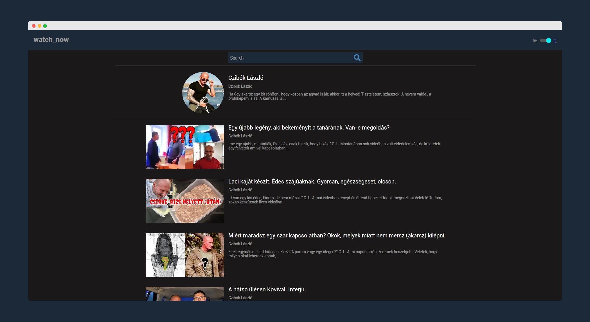

# Watch Now

## [Check live demo!](https://mbr-mf.netlify.com/)

This React application uses the YouTube API to list videos depending on search terms. You can click on the desired thumbnails to play the embed video and you can view the user posts too.

## How to Use

Use the search bar to type in a search term then hit Enter or click the search icon to submit your request. The app returns data depending on your input. You can click on the listed thumbnails to see a detailed page and play an embed video or check the user comments. 

## Built With

- React JS
- React Router
- YouTube API
- SCSS
